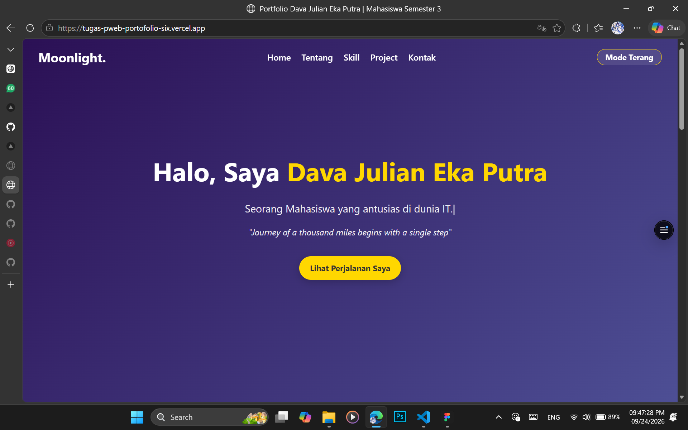
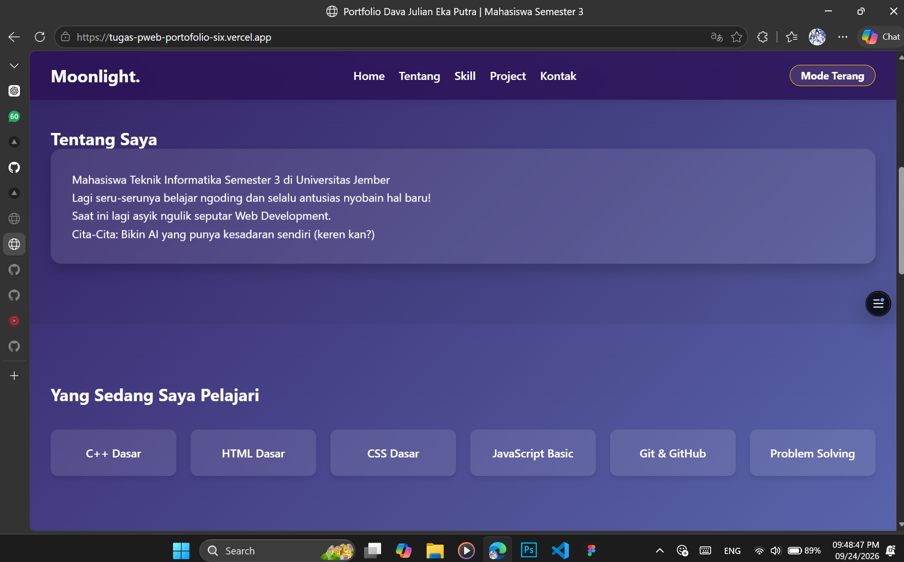
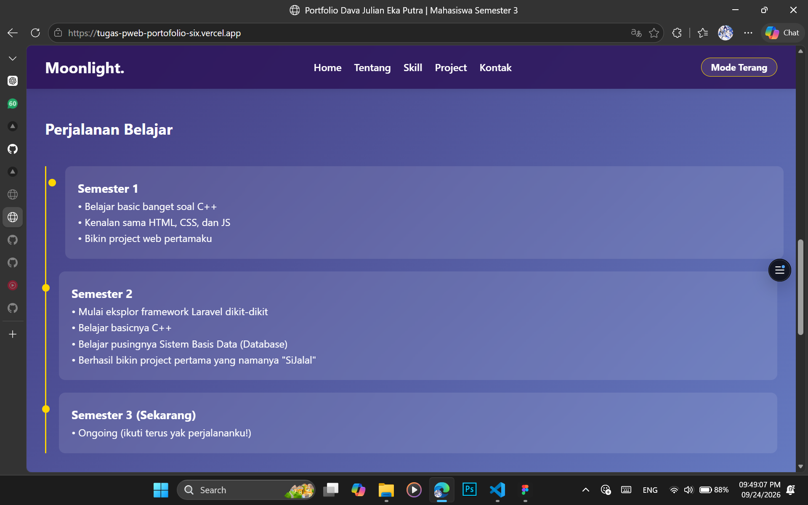
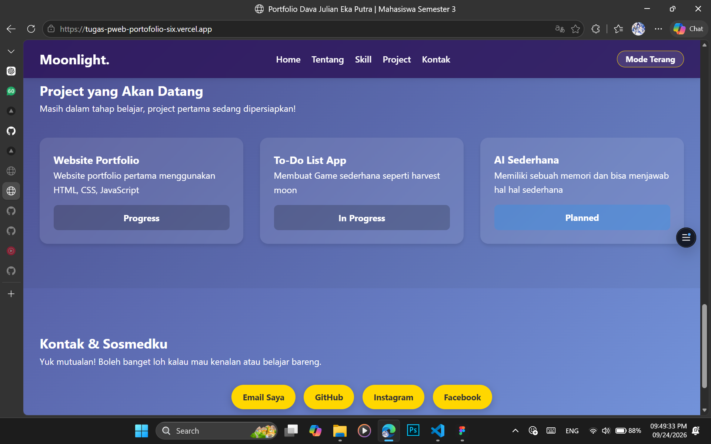

# Portfolio Website

Website ini merupakan website portfolio pribadi yang dibuat sebagai tugas slicing website. Website berisi informasi singkat mengenai diri saya, skill yang sedang dipelajari, perjalanan belajar, project, serta kontak dan sosial media.

Website ini dibuat menggunakan:
- HTML
- CSS
- JavaScript

Website juga dibuat responsive agar dapat digunakan pada perangkat desktop, tablet, maupun mobile.

## Fitur

Beberapa fitur yang terdapat pada website ini:
- Responsive layout untuk desktop, tablet, dan mobile
- Navigasi antar section
- Smooth scrolling
- Mode terang dan mode gelap
- Typing effect pada bagian utama
- Animasi saat melakukan scroll
- Interaksi pada beberapa elemen website

## Screenshot

## Website

https://tugas-pweb-portofolio-six.vercel.app/

## Repository

https://github.com/Moonlight-arch/Tugas-PWEB-Portfolio
